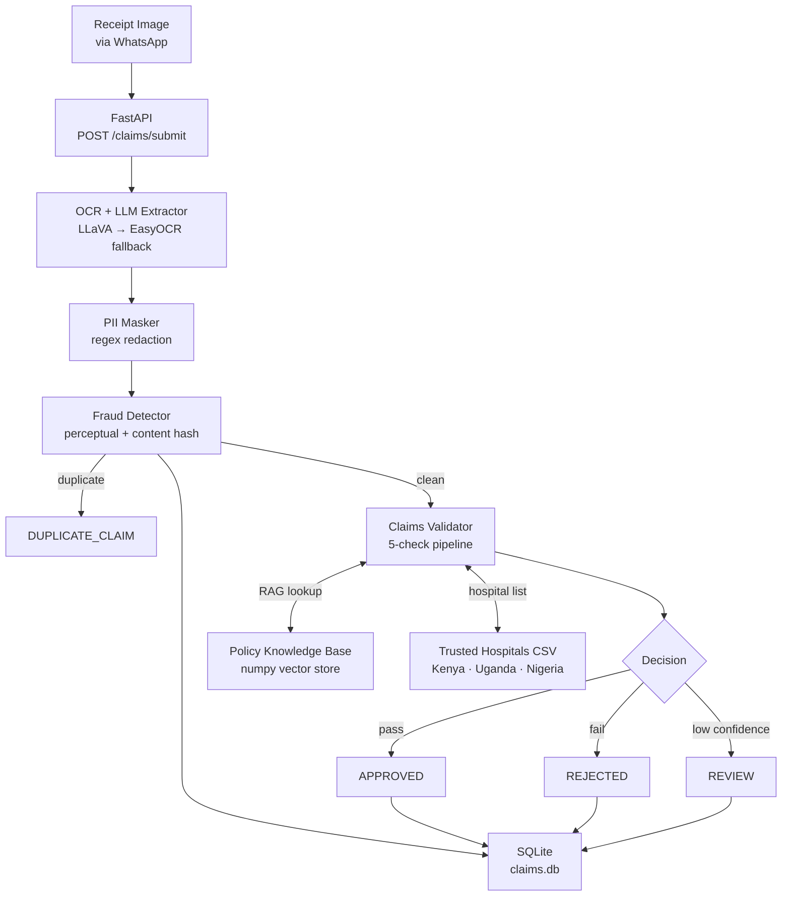

# TuracoFlow

An automated claims validation pipeline built to mirror Turaco Insurance's real-world operations — multi-country policies, WhatsApp receipt photos, and mobile-money payouts across Kenya, Uganda, and Nigeria.

A receipt image goes in. A structured claim decision (APPROVED / REJECTED / REVIEW) comes out, with a full audit trail of every check that was run.

---

## Architecture



---

## Pipeline — step by step

| Step | Module | What it does |
|------|--------|-------------|
| 1 | `extractor.py` | LLaVA (vision LLM) reads the receipt image and returns structured JSON. If confidence < threshold or parsing fails, falls back to EasyOCR → LLaMA 3.2. |
| 2 | `pii_masker.py` | Regex redacts patient names, national IDs, phone numbers, and emails **before** any data is stored or logged. |
| 3 | `fraud.py` | Computes a perceptual hash (imagehash) and a SHA-256 content hash. Checks both against SQLite — blocks resubmissions of the same photo or same claim data with a different photo. |
| 4 | `validator.py` | Runs five sequential checks: confidence threshold → completeness → hospital trust → diagnosis coverage (RAG) → limits (nights × rate vs. cap). Returns `APPROVED`, `REJECTED`, or `REVIEW` with per-check audit trail. |
| 5 | `rag.py` | Policy Knowledge Base built from 6 policy documents (3 countries × 2 products). Embedded with `all-MiniLM-L6-v2` and stored in a pure-numpy vector store. Supports country + product-type filtering. |

---

## Running locally

### Prerequisites

- Python 3.12+
- [Ollama](https://ollama.com/) running locally with two models pulled:
  ```
  ollama pull llava:7b
  ollama pull llama3.2:latest
  ```

### Setup

```bash
git clone <repo-url>
cd turaco_ins_tech

python -m venv .venv
.venv\Scripts\activate          # Windows
# source .venv/bin/activate     # macOS / Linux

pip install -r requirements.txt
```

### Build the policy index

Embeds the 6 policy documents into the numpy vector store. Only needed once.

```bash
python scripts/build_index.py
```

### Run the demo

End-to-end pipeline in a single command — no server needed:

```bash
python demo.py                                       # approved receipt
python demo.py data/receipts/receipt_over_limit.png  # over-limit receipt
```

Example output:
```
━━━━━━━━━━━━ TuracoFlow — Claims Pipeline Demo ━━━━━━━━━━━━
  Receipt : data/receipts/receipt_approved.png
  Claim ID: CLM-00A8D486
────────────────────────────────────────────────────────────

  Loading modules...
  [1/5] Loading policy index...         ✓  (loaded)
  [2/5] Extracting receipt data...      ✓  (method: llava, confidence: 0.82)
  [3/5] Masking PII...                  ✓  (1 field(s) redacted)
  [4/5] Checking for fraud...           ✓  (clean)
  [5/5] Validating claim...             ✓  (APPROVED)

━━━━━━━━━━━━━━━━━━━━━━━━━━━━━━━━━━━━━━━━━━━━━━━━━━━━━━━━━━━
    STATUS:             ✓  APPROVED
    AMOUNT:             KES 3,000
    POLICY:             TUR-KE-HC-001
    REASON:             Valid 3-night inpatient stay for
                        Malaria and Diarrhea at Kenyatta
                        National Hospital. Payout: 1,000 x
                        3 nights.
    CONFIDENCE:         82%
━━━━━━━━━━━━━━━━━━━━━━━━━━━━━━━━━━━━━━━━━━━━━━━━━━━━━━━━━━━

  Audit trail:
    ✓  confidence             Confidence 0.82 ≥ threshold 0.75
    ✓  completeness           All critical fields present.
    ✓  hospital_trusted       'Kenyatta National Hospital' is a Turaco…
    ✓  diagnosis_covered      'Malaria and Diarrhea' is covered under…
    ✓  limits                 3 nights x 1,000 = 3,000 (cap: 10,000).
```

### Start the API server

```bash
uvicorn app.main:app --reload
```

Endpoints:

| Method | Path | Description |
|--------|------|-------------|
| `GET` | `/health` | Service health + index status |
| `POST` | `/claims/submit` | Submit a receipt image for processing |
| `GET` | `/claims/{id}` | Look up a previously submitted claim |

Interactive docs: `http://localhost:8000/docs`

---

## Running the tests

```bash
# Fast unit tests only (no Ollama required, ~5 seconds)
python -m pytest tests/ -m "not slow" -v

# Full suite including LLM integration tests (~20 minutes)
python -m pytest tests/ -v
```

### Test coverage

| File | Tests | Speed | What it covers |
|------|-------|-------|----------------|
| `test_rag.py` | 13 | fast | Embedding, chunking, retrieval, country filtering |
| `test_extractor.py` | 13 | 8 fast / 5 slow | JSON parsing, field extraction, LLaVA + fallback |
| `test_pii_masker.py` | 21 | fast | Name, ID, phone, email redaction across KE/UG/NG formats |
| `test_validator.py` | 16 | fast | All 5 checks — approve, reject, and review paths |
| `test_fraud.py` | 13 | fast | Hash stability, duplicate detection, SQLite persistence |
| `test_api.py` | 8 | 2 fast / 6 slow | Full HTTP pipeline, duplicate submission, 404 handling |
| **Total** | **84** | | |

---

## Key design decisions

### numpy vector store instead of LanceDB

LanceDB requires PyArrow, which ships compiled DLLs that are frequently blocked by corporate security policies on Windows. Replacing it with a pure-numpy vector store (cosine similarity, JSON metadata) eliminated the dependency entirely with no meaningful performance cost at this data scale (6 policy documents, ~60 chunks).

### Regex instead of spaCy for PII masking

Hospital receipts are structured documents — patient names always follow known labels like `Patient Name:` or `Claimant:`. A targeted, label-anchored regex is more reliable than a general NER model for this specific format, and requires no model download, no compilation step, and no GPU.

### Two-hash fraud detection

A single hash would miss resubmissions where the image has been slightly compressed or cropped. The two-layer strategy handles both attack vectors:
- **Perceptual hash** (imagehash pHash, Hamming distance ≤ 8): catches the same photo resubmitted with minor edits
- **SHA-256 content hash** of key claim fields: catches the same claim data submitted with a completely different photo

### LLaVA → EasyOCR fallback

LLaVA (vision LLM) reads structured meaning directly from the image and handles varied receipt layouts well. When it returns fewer than the minimum required fields or produces unparseable JSON, EasyOCR extracts raw text and LLaMA 3.2 structures it — ensuring extraction always produces output rather than failing silently.

### SQLite for persistence

Zero extra dependencies, built into Python, and sufficient for a claims volume in the thousands per day. The file-based approach means the fraud history survives service restarts without needing a separate database service.

---

## Project structure

```
turaco_ins_tech/
├── app/
│   ├── api/routes/claims.py    # FastAPI routes
│   ├── core/config.py          # Settings (Pydantic)
│   ├── models/schemas.py       # Request/response schemas
│   └── modules/
│       ├── extractor.py        # OCR + LLM extraction
│       ├── fraud.py            # Duplicate detection
│       ├── pii_masker.py       # PII redaction
│       ├── rag.py              # Policy RAG pipeline
│       ├── validator.py        # 5-check validation engine
│       └── vector_store.py     # numpy vector store
├── data/
│   ├── hospitals/              # Trusted hospital lists (KE/UG/NG)
│   ├── policies/               # 6 policy documents
│   └── receipts/               # Sample receipt images
├── scripts/build_index.py      # One-time index builder
├── tests/                      # 84 pytest tests
├── demo.py                     # End-to-end CLI demo
└── pytest.ini
```

---

## Policies supported

| Country | Product | Currency | Per-night rate | Max nights | Cap |
|---------|---------|----------|---------------|------------|-----|
| Kenya | HospiCash | KES | 1,000 | 10 | 10,000 |
| Uganda | HospiCash | UGX | 30,000 | 10 | 300,000 |
| Uganda | Personal Accident | UGX | 30,000 | 10 | 300,000 |
| Nigeria | HospiCash | NGN | 5,000 | 10 | 50,000 |
