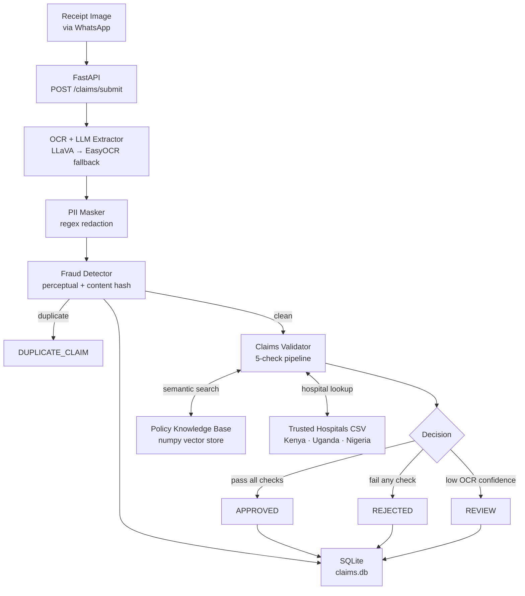

# TuracoFlow

> Automated WhatsApp Claims Validator — Turaco Insurance

TuracoFlow is a production-grade AI claims processing pipeline that mirrors Turaco Insurance's real-world operations across Kenya, Uganda, and Nigeria. A customer photographs their hospital receipt on WhatsApp. TuracoFlow extracts the structured data, masks PII, checks for fraud, validates against the correct policy, and returns a decision — all without human intervention.

**A receipt image goes in. A structured claim decision comes out.**

```
STATUS:   ✓ APPROVED
AMOUNT:   KES 3,000
REASON:   Valid 3-night inpatient stay for Malaria at Kenyatta National Hospital
```

---

## Table of Contents

1. [Why this exists](#why-this-exists)
2. [Architecture](#architecture)
3. [Pipeline — step by step](#pipeline--step-by-step)
4. [Tech stack](#tech-stack)
5. [Project structure](#project-structure)
6. [Running locally](#running-locally)
7. [Docker deployment](#docker-deployment)
8. [Streamlit dashboard](#streamlit-dashboard)
9. [API reference](#api-reference)
10. [Running the tests](#running-the-tests)
11. [Key design decisions](#key-design-decisions)
12. [Performance & scaling](#performance--scaling)
13. [Policies supported](#policies-supported)

---

## Why this exists

Turaco Insurance processes claims from low-income policyholders across East and West Africa. Claims arrive as receipt photos over WhatsApp. Today that process involves manual review — a slow, expensive bottleneck that delays payouts to people who need them most.

TuracoFlow automates the full pipeline:

- **Multi-country awareness** — Kenya, Uganda, Nigeria each have different policy products, currency, hospital networks, and claim limits
- **Receipt-first design** — works with photos of handwritten or printed hospital receipts, not structured API data
- **Privacy by default** — PII is redacted before any data is logged or stored
- **Fraud resistance** — two-layer hashing detects duplicate submissions even when images are re-edited
- **Full explainability** — every decision includes a per-check audit trail

---

## Architecture



---

## Pipeline — step by step

### Step 1 — OCR + LLM Extraction (`extractor.py`)

Takes the raw receipt image and returns structured JSON with 11 fields.

**Primary path — LLaVA (vision LLM):**
LLaVA reads the image directly without any OCR pre-processing. It understands layout, handwriting, and context — not just raw text. If it returns at least 6 of the 11 required fields, the result is accepted.

**Fallback path — EasyOCR → LLaMA 3.2:**
If LLaVA returns too few fields or fails to parse, EasyOCR extracts raw text from the image. LLaMA 3.2 then structures that text into the required JSON format. The fallback confidence score is penalised by 15% to reflect the higher risk of OCR errors.

**Blur detection:**
A Laplacian variance score measures image sharpness and scales down the final confidence score for blurry photos — reducing the chance of a blurry receipt being auto-approved.

**Missing nights rescue:**
If the number of nights is not explicitly stated, the extractor computes it from admission and discharge dates. If dates are also missing, it applies regex patterns (`"3 nights"`, `"Length of stay: 3"`) to the raw OCR text.

Output fields:
```
patient_name, hospital_name, admission_date, discharge_date,
nights, diagnosis, diagnosis_code, total_cost, currency, country, policy_number
```

---

### Step 2 — PII Masking (`pii_masker.py`)

Redacts personally identifiable information **before** any data is stored, logged, or passed downstream.

| PII type | Pattern | Example |
|----------|---------|---------|
| Patient name | Label-anchored regex (`Patient Name: ...`) | `[REDACTED NAME]` |
| National ID | Country-specific formats (KE 7–8 digits, UG 2+11+2, NG 11 digits) | `[REDACTED ID]` |
| Phone number | African mobile formats (`+254`, `+256`, `+234`, `07xx`) | `[REDACTED PHONE]` |
| Email | Standard RFC pattern | `[REDACTED EMAIL]` |

Policy numbers (`TUR-KE-HC-001-XXXXX`) are explicitly preserved — they are needed for claim lookup.

Design choice: regex-only, no NLP model. Hospital receipts are structured documents where names always follow known labels. A targeted label-anchored regex is more reliable and requires no model download.

---

### Step 3 — Fraud Detection (`fraud.py`)

Two-layer hashing strategy detects duplicate claims before validation runs.

**Layer 1 — Perceptual hash (imagehash pHash):**
A 64-bit hash of the image's visual structure. Two images are considered the same if their Hamming distance is ≤ 8, which tolerates minor compression, resizing, and cropping artefacts.

**Layer 2 — SHA-256 content hash:**
A deterministic hash of the 8 key claim fields (patient name, hospital, dates, diagnosis, amount, currency, policy number). Catches the same claim data submitted with a completely different photo.

Both hashes are stored in SQLite after every decision. If either hash matches a previous record, the claim is rejected as `DUPLICATE_CLAIM` without running the validator.

---

### Step 4 — Claims Validation (`validator.py`)

Five sequential checks. A claim must pass all five to be approved. The first check to fail short-circuits the pipeline and determines the final status.

| # | Check | Pass condition | Fail status |
|---|-------|---------------|-------------|
| 1 | Confidence | OCR confidence ≥ 0.75 | `REVIEW` |
| 2 | Completeness | All critical fields present | `REJECTED` |
| 3 | Hospital trust | Hospital is on the trusted list for this country | `REJECTED` |
| 4 | Diagnosis coverage | Diagnosis is covered by the policy (via RAG) | `REJECTED` |
| 5 | Limits | Nights × rate ≤ policy cap | `REJECTED` |

The hospital check uses fuzzy matching (normalised exact → substring → word overlap) to handle abbreviations like `"Kenyatta Nat. Hospital"` matching `"Kenyatta National Hospital"`.

The diagnosis coverage check uses semantic search against the policy knowledge base, filtered by country and product type so Kenya queries never bleed into Nigeria results.

---

### Step 5 — Policy Knowledge Base (`rag.py`)

A RAG (Retrieval-Augmented Generation) pipeline that answers coverage questions from 6 policy documents.

- **Documents:** 3 countries × 2 products = 6 policy text files
- **Chunking:** split by section headers (OVERVIEW, COVERAGE DETAILS, EXCLUSIONS, etc.)
- **Embeddings:** `all-MiniLM-L6-v2` via sentence-transformers (local, no API key)
- **Storage:** pure-numpy vector store — cosine similarity search over a `.npy` array with a `.json` metadata sidecar
- **Filtering:** every query is filtered by `country` and `product_type` metadata before ranking

The vector store is built once by `scripts/build_index.py` and loaded into memory on startup.

---

## Tech stack

| Layer | Technology | Why |
|-------|-----------|-----|
| API | FastAPI + uvicorn | Async, automatic OpenAPI docs, Pydantic validation |
| Vision extraction | LLaVA 7B via Ollama | Local, free, handles varied receipt layouts |
| OCR fallback | EasyOCR + LLaMA 3.2 | Robust text extraction without GPU |
| Embeddings | sentence-transformers (`all-MiniLM-L6-v2`) | Local, fast, no API key |
| Vector store | numpy + JSON | Zero compiled dependencies, no DLL issues |
| PII masking | Regex | Portable, no model download, reliable on structured docs |
| Fraud detection | imagehash + SHA-256 + SQLite | Zero extra deps, survives restarts |
| UI | Streamlit | Rapid dashboard with minimal code |
| Containerisation | Docker + Compose | Single-command deployment |
| Testing | pytest + httpx TestClient | 84 tests across all modules |

---

## Project structure

```
turaco_ins_tech/
├── app/
│   ├── api/
│   │   └── routes/
│   │       └── claims.py         # POST /claims/submit, GET /claims/{id}
│   ├── core/
│   │   └── config.py             # Pydantic settings (reads from .env)
│   ├── models/
│   │   └── schemas.py            # ClaimSubmitResponse, ClaimStatusResponse
│   ├── modules/
│   │   ├── extractor.py          # LLaVA → EasyOCR+LLM extraction engine
│   │   ├── fraud.py              # Dual-hash duplicate detection + SQLite
│   │   ├── pii_masker.py         # Regex PII redaction
│   │   ├── rag.py                # Policy RAG pipeline
│   │   ├── validator.py          # 5-check validation engine
│   │   └── vector_store.py       # numpy cosine-similarity vector store
│   └── main.py                   # FastAPI app + lifespan startup
├── data/
│   ├── hospitals/
│   │   └── trusted_hospitals.csv # ~30 hospitals across KE/UG/NG
│   ├── policies/                 # 6 policy text documents
│   │   ├── kenya_hospicash.txt
│   │   ├── kenya_last_expense.txt
│   │   ├── uganda_hospicash.txt
│   │   ├── uganda_personal_accident.txt
│   │   ├── nigeria_hospicash.txt
│   │   └── nigeria_last_expense.txt
│   └── receipts/                 # Sample receipt images for testing
│       ├── receipt_approved.png
│       ├── receipt_over_limit.png
│       └── receipt_low_confidence.png
├── scripts/
│   ├── build_index.py            # One-time policy index builder
│   └── entrypoint.sh             # Docker startup script
├── tests/
│   ├── conftest.py               # Shared fixtures (fraud DB isolation)
│   ├── test_api.py               # FastAPI integration tests
│   ├── test_extractor.py         # Extraction engine tests
│   ├── test_fraud.py             # Fraud detection tests
│   ├── test_pii_masker.py        # PII masking tests
│   ├── test_rag.py               # RAG pipeline tests
│   └── test_validator.py         # Claims validator tests
├── ui/
│   ├── app.py                    # Streamlit dashboard
│   ├── Dockerfile                # UI container
│   └── requirements.txt          # streamlit + requests only
├── demo.py                       # End-to-end CLI demo (no server needed)
├── Dockerfile                    # API container
├── docker-compose.yml            # Orchestrates API + UI
├── .dockerignore
├── pytest.ini
└── requirements.txt
```

---

## Running locally

### Prerequisites

- Python 3.12+
- [Ollama](https://ollama.com/) installed and running
- Two models pulled:

```bash
ollama pull llava:7b
ollama pull llama3.2:latest
```

### 1. Clone and install

```bash
git clone <repo-url>
cd turaco_ins_tech

python -m venv .venv
.venv\Scripts\activate        # Windows
# source .venv/bin/activate   # macOS / Linux

pip install -r requirements.txt
```

### 2. Configure environment

```bash
cp .env.example .env
# Edit .env if your Ollama runs on a non-default port
```

### 3. Build the policy index

Embeds the 6 policy documents into the vector store. Only needed once — result is saved to `vector_store/`.

```bash
python scripts/build_index.py
```

### 4. Run the CLI demo

End-to-end pipeline in a single command. No server required.

```bash
python demo.py                                        # approved receipt
python demo.py data/receipts/receipt_over_limit.png   # over-limit
python demo.py data/receipts/receipt_low_confidence.png
```

Example output:
```
━━━━━━━━━━━ TuracoFlow — Claims Pipeline Demo ━━━━━━━━━━━━
  Receipt : data/receipts/receipt_approved.png
  Claim ID: CLM-00A8D486
──────────────────────────────────────────────────────────

  [1/5] Loading policy index...         ✓  (loaded)
  [2/5] Extracting receipt data...      ✓  (method: llava, confidence: 0.82)
  [3/5] Masking PII...                  ✓  (1 field(s) redacted)
  [4/5] Checking for fraud...           ✓  (clean)
  [5/5] Validating claim...             ✓  (APPROVED)

━━━━━━━━━━━━━━━━━━━━━━━━━━━━━━━━━━━━━━━━━━━━━━━━━━━━━━━━━━
    STATUS:             ✓  APPROVED
    AMOUNT:             KES 3,000
    POLICY:             TUR-KE-HC-001
    REASON:             Valid 3-night inpatient stay for
                        Malaria and Diarrhea at Kenyatta
                        National Hospital. Payout: 1,000 x
                        3 nights.
    CONFIDENCE:         82%
━━━━━━━━━━━━━━━━━━━━━━━━━━━━━━━━━━━━━━━━━━━━━━━━━━━━━━━━━━

  Audit trail:
    ✓  confidence             Confidence 0.82 ≥ threshold 0.75
    ✓  completeness           All critical fields present.
    ✓  hospital_trusted       'Kenyatta National Hospital' is a Turaco…
    ✓  diagnosis_covered      'Malaria and Diarrhea' is covered under…
    ✓  limits                 3 nights x 1,000 = 3,000 (cap: 10,000).
```

### 5. Start the API server

```bash
uvicorn app.main:app --reload
```

Interactive Swagger docs: `http://localhost:8000/docs`

---

## Docker deployment

The entire stack (API + Streamlit UI) runs in two containers with a single command. Ollama runs on the host machine — the containers talk to it over `host.docker.internal`.

### Start

```bash
docker compose up --build
```

On first boot, the entrypoint script detects a missing vector store and builds the policy index automatically. Subsequent starts skip this step.

### Stop

```bash
docker compose down
```

### Access

| Interface | URL |
|-----------|-----|
| Streamlit dashboard | `http://localhost:8501` |
| Swagger API docs | `http://localhost:8000/docs` |
| Health check | `http://localhost:8000/health` |

### Volumes

Data is persisted in named Docker volumes — claim history and the policy index survive container restarts and rebuilds.

| Volume | Contents |
|--------|----------|
| `turacoflow_data` | Vector store (`vectors.npy`, `records.json`) + SQLite (`claims.db`) |
| `turacoflow_models` | EasyOCR model weights |
| `turacoflow_st_cache` | sentence-transformers model cache |

### Rebuild the policy index manually

```bash
docker compose exec turacoflow python scripts/build_index.py
```

---

## Streamlit dashboard

The UI provides a visual interface for submitting claims and viewing decisions.

**Left panel:** upload a receipt image, enter Customer ID and Policy ID, click Submit.

**Right panel:** colour-coded status badge, approved amount, confidence score, reason, and an expandable audit trail showing the result of every check.

| Status | Colour |
|--------|--------|
| APPROVED | Green |
| REJECTED | Red |
| NEEDS REVIEW | Amber |
| DUPLICATE | Purple |

> Note: The first submission after a cold start takes 2–3 minutes while LLaVA loads into memory. Subsequent requests are significantly faster.

---

## API reference

### `GET /health`

Returns service status and whether the policy index is loaded.

```json
{
  "status": "ok",
  "service": "TuracoFlow",
  "index_ready": true
}
```

---

### `POST /claims/submit`

Submit a receipt image for processing.

**Request** — `multipart/form-data`

| Field | Type | Description |
|-------|------|-------------|
| `image` | file | Receipt photo (JPEG or PNG) |
| `customer_id` | string | Customer identifier |
| `policy_id` | string | Turaco policy number (e.g. `TUR-KE-HC-001-88234`) |

**Response**

```json
{
  "claim_id": "CLM-00A8D486",
  "status": "APPROVED",
  "approved_amount": 3000.0,
  "currency": "KES",
  "reason": "Valid 3-night inpatient stay for Malaria at Kenyatta National Hospital.",
  "policy_matched": "TUR-KE-HC-001",
  "confidence": 0.82,
  "extraction_method": "llava",
  "fraud_check": "clean",
  "checks": {
    "confidence":         {"passed": true,  "detail": "Confidence 0.82 ≥ threshold 0.75"},
    "completeness":       {"passed": true,  "detail": "All critical fields present."},
    "hospital_trusted":   {"passed": true,  "detail": "'Kenyatta National Hospital' is a Turaco partner."},
    "diagnosis_covered":  {"passed": true,  "detail": "'Malaria' is covered under HospiCash Kenya."},
    "limits":             {"passed": true,  "detail": "3 nights x 1,000 = 3,000 (cap: 10,000)."}
  }
}
```

**Status values:**

| Status | Meaning |
|--------|---------|
| `APPROVED` | All 5 checks passed — payout authorised |
| `REJECTED` | One or more checks failed — claim denied |
| `REVIEW` | OCR confidence too low — send to human reviewer |
| `DUPLICATE_CLAIM` | Image or content hash matched a previous submission |

---

### `GET /claims/{claim_id}`

Look up a previously submitted claim.

```json
{
  "claim_id": "CLM-00A8D486",
  "status": "APPROVED",
  "hospital_name": "Kenyatta National Hospital",
  "submission_date": "2026-04-03T00:00:00+00:00"
}
```

Returns `404` if the claim ID is not found.

---

## Running the tests

```bash
# Fast unit tests only — no Ollama needed, runs in ~5 seconds
python -m pytest tests/ -m "not slow" -v

# Full suite including LLM integration tests — needs Ollama, ~20 minutes
python -m pytest tests/ -v
```

### Test coverage

| File | Tests | Notes |
|------|-------|-------|
| `test_pii_masker.py` | 21 | All PII types across KE/UG/NG formats, edge cases |
| `test_validator.py` | 16 | All 5 checks — approve, reject, and review paths for each country |
| `test_rag.py` | 13 | Embedding, chunking, retrieval accuracy, country/product filtering |
| `test_extractor.py` | 13 | JSON parsing, field extraction, confidence scoring, LLaVA + fallback paths |
| `test_fraud.py` | 13 | Hash stability, duplicate detection (image + content), SQLite persistence |
| `test_api.py` | 8 | Full HTTP pipeline, duplicate submission, required fields, 404 handling |
| **Total** | **84** | |

Test isolation: `tests/conftest.py` wipes the fraud database before every test using an `autouse` fixture, preventing hash collisions between test runs.

---

## Key design decisions

### numpy vector store instead of LanceDB

LanceDB requires PyArrow, which ships compiled DLLs that are frequently blocked by corporate security policies on Windows. Replacing it with a pure-numpy vector store (cosine similarity, JSON metadata sidecar) eliminated the dependency entirely with no meaningful performance cost at this data scale (6 policy documents, ~60 chunks). The store loads into memory in under a second.

### Regex instead of spaCy for PII masking

Hospital receipts are structured documents — patient names always appear after known labels like `Patient Name:` or `Claimant:`. A targeted, label-anchored regex is more reliable than a general NER model for this specific format. It also requires no model download, no compilation, and no GPU — making it portable across any environment.

### Two-hash fraud detection

A single content hash would miss resubmissions where the photo has been slightly compressed, cropped, or screenshot. A single image hash would miss the same claim data submitted with a different photo entirely. The two-layer strategy covers both:
- **Perceptual hash** (imagehash pHash, Hamming distance ≤ 8): catches the same photo resubmitted with minor edits
- **SHA-256 content hash** of 8 key claim fields: catches the same claim data with a different photo

### LLaVA → EasyOCR + LLaMA fallback

LLaVA reads structured meaning directly from the image — it handles varied receipt layouts, handwriting, and implicit information well. When it underperforms (< 6 of 11 fields extracted), EasyOCR extracts raw text and LLaMA 3.2 structures it into JSON. The two-path design means extraction always produces output rather than failing silently, and the confidence score reflects which path was used.

### SQLite for fraud persistence

Zero extra dependencies, built into Python, and sufficient for thousands of claims per day. The file-based approach means fraud history survives service restarts without a separate database service. A `clear()` method is exposed for test isolation.

### FastAPI with module-level singletons

`FraudDetector` and `ClaimsValidator` are instantiated once at module load time and reused across all requests. This avoids re-loading the hospital CSV, RAG index, and SQLite connection pool on every request — critical for a service where cold-start latency already comes from the LLM.

---

## Performance & scaling

The main bottleneck is LLaVA running on CPU via Ollama (~2–5 minutes per receipt on a standard laptop). The architecture is designed so the model layer can be swapped without touching any other code.

| Approach | Latency | Tradeoff |
|----------|---------|----------|
| LLaVA 7B on CPU (current) | 2–5 min | Free, fully local, no API key |
| Moondream 1.8B on CPU | ~60s | Slightly lower accuracy, still local |
| LLaVA / LLaMA on GPU (RTX 3060+) | 5–15s | 10–50× faster, requires GPU hardware |
| GPT-4o mini / Claude Haiku (API) | 2–5s | Fastest + most accurate, costs ~$0.001/receipt, PII leaves infrastructure |
| Async processing + polling | Same speed, better UX | Submit returns job ID; UI polls `GET /claims/{id}` |

For production at Turaco's scale, the recommended path is a hosted vision API (GPT-4o mini or Claude Haiku) with the async processing pattern. The extractor module is already isolated behind a clean interface — swapping the model is a one-line config change in `.env`.

---

## Policies supported

| Country | Product | Currency | Per-night rate | Max nights | Payout cap |
|---------|---------|----------|---------------|------------|------------|
| Kenya | HospiCash | KES | 1,000 | 10 | 10,000 |
| Uganda | HospiCash | UGX | 30,000 | 10 | 300,000 |
| Uganda | Personal Accident | UGX | 30,000 | 10 | 300,000 |
| Nigeria | HospiCash | NGN | 5,000 | 10 | 50,000 |

Global exclusions (all policies): cosmetic, elective, self-inflicted, substance abuse, experimental, and traditional medicine diagnoses.
